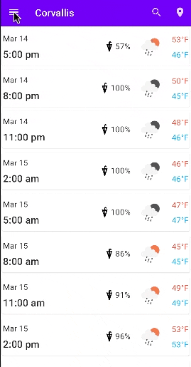

# Assignment 4
**Due by 11:59pm on Monday, 3/13/2023**  
**Demo due by 5:00pm on Friday, 3/24/2023**

In this assignment, we'll use the [Room persistence library](https://developer.android.com/training/data-storage/room) to incorporate an SQLite database into our weather app to save the locations for which the user requests a forecast.  You'll also add a navigation drawer that will display a list of previously requested cities so the user can more easily get the forecasts for the cities that are most improtant to them.  There are a few different tasks associated with this assignment, described below.  This repository provides you with some starter code that implements the `ViewModel`-based weather app from assignment 3.  The screen capture below depicts the behavior you'll implement for this assignment:

**NOTE: make sure to add your own API key as described in [`MainActivity.kt`](app/src/main/java/com/example/roomyweather/ui/MainActivity.kt#L28-L56) to make the app work.**

## 1. Use the Room persistence library to save forecast locations

Your first task is to use the Room persistence library to incorporate an SQLite database into your app.  Whenever the user requests a forecast for a new city, you'll save a representation of that city in your database.  You'll want to store two different pieces of data for each city in the database:
  * The name of the city (e.g. "Corvallis,OR,US").  This will be enough to re-query the OpenWeather API to fetch forecast data for the city when the user chooses it in the navigation drawer.
  * A timestamp indicating when the user last viewed a forecast of this city (we'll see in a minute how this is used).  You can represent this as a `Long` value and, when the time comes, set it using Java's [`System.currentTimeMillis()`](https://docs.oracle.com/javase/8/docs/api/java/lang/System.html#currentTimeMillis--).

To make this work with the Room persistence library, you'll need to define an Entity, a Data Access Object (DAO), and a Database class.

> Hint: there are already several data classes being used in the app, including one representing a city within the JSON response from the OpenWeather API.  However, it will still probably be easiest if you implement a new data class to serve as your Room Entity.  In this new Entity class, you'll just need properties representing the city's name and the timestamp.

## 2. Save the cities for which the user requests a forecast

Next, modify your app so that whenever the user changes the forecast city in the application settings, the new city is saved into the database you just created.  A given city should be stored at most once in the database.  In other words, your database should not contain duplicate cities.  To save cities into the database, you'll have to detect when the city setting has changed and save the new city into the database if it's not already there.

> Hint: You'll probably want to specify [an `OnConflictStragety` in your `@Insert` query](https://developer.android.com/reference/kotlin/androidx/room/Insert#onconflict) to make it easy to avoid duplicate database entries.

Once you have your app hooked up to save cities in the database, use [Android Studio's Database Inspector](https://developer.android.com/studio/inspect/database) to verify that the data is being stored correctly.

## 3. Update the app to use the Jetpack Navigation component

In order to make it easy to incorporate a navigation drawer in the app, you'll want to migrate your app to use the [Android Jetpack Navigation component](https://developer.android.com/guide/navigation) to manage navigation between screens.  There will be a few steps you need to take to make this work:

  1. Convert your `Activity` classes to `Fragment` classes.  You should have three of these for the following screens:
      * The forecast list screen (i.e. the old main activity)
      * The forecast detail screen
      * The settings screen (you already have a `Fragment` representing this)

  2. Define a [navigation graph](https://developer.android.com/guide/navigation/navigation-getting-started#create-nav-graph) linking these screens together.  The `Fragment` representing the forecast list screen should be the start destination in this graph.

  3. Add [navigation actions](https://developer.android.com/guide/navigation/navigation-navigate) to your `Fragment` classes to allow the user navigate between them.  Make sure to [pass any relevant data](https://developer.android.com/guide/navigation/navigation-pass-data) to each `Fragment` when you navigate to it (e.g. the detailed forecast information should be passed to the forecast detail screen).  Use the Safe Args plugin to make it easier to navigate programatically when you need to.

  4. Add [a `NavHostFragment`](https://developer.android.com/guide/navigation/navigation-getting-started#add-navhost) to the main activity, so your different screens can be displayed there.

  5. Use [the `NavigationUI`](https://developer.android.com/guide/navigation/navigation-ui) to manage the top app bar and to provide [a navigation drawer](https://developer.android.com/guide/navigation/navigation-ui#add_a_navigation_drawer) the user can use to navigate between destinations in your app.  The navigation drawer only needs to contain links to the forecast list screen and the settings screen, not the forecast detail screen.

## 4. Add a list of saved cities to the navigation drawer

Next, modify your navigation drawer to list all of the cities saved in the database (in addition to displaying links to your app's different screens).  Importantly, you should display the cities *ordered from most-recently viewed to least-recently viewed* based on the timestamps stored in the database.

You can incorporate this list of cities directly into a `NavigationView` if that's what you're using to provide content for your navigation drawer, but you'll have to do this a little differently than the way we specified `NavigationView` content in lecture.  Specifically, in class, we specified the static `NavigationView` content using an XML menu file.  For this app, you'll need to provide dynamic `NavigationView` content based on the cities stored in your database.

Luckily, you can use a `NavigationView`'s [`getMenu()` method](https://developer.android.com/reference/com/google/android/material/navigation/NavigationView#getMenu()) to programmatically access and manipulate the `Menu` specifying the `NavigationView` content.  You should use the [`Menu` class's documentation](https://developer.android.com/reference/kotlin/android/view/Menu) to figure out how to programatically add an item to the `NavigationView` for each city stored in your database.  This will likely be easiest if all of the cities in the `NavigationView` live within their own [`SubMenu`](https://developer.android.com/reference/kotlin/android/view/SubMenu).

## 5. Update the forecast when the user clicks on a city in the navigation drawer

Finally, hook your app up so that when the user clicks on an city in your navigation drawer, the following four actions occur:
  * The navigation drawer closes.
  * The app fetches and displays the forecast for the location corresponding to the item that was clicked.
  * The "last viewed" timestamp is updated to "now" in the database for the location corresponding to the item that was clicked.
  * The "city" setting is updated to the name of the city that was clicked.

There are various ways you could accomplish this.  Again, try to use the [`Menu` class's documentation](https://developer.android.com/reference/kotlin/android/view/Menu) to figure out how to respond when a city item is clicked.

> Hint: the most straightforward way to update the "city" setting is use a [`SharedPreferences.Editor`](https://developer.android.com/reference/kotlin/android/content/SharedPreferences#edit) (making sure to [apply the changes](https://developer.android.com/reference/kotlin/android/content/SharedPreferences.Editor#apply)).

## Extra credit: A better way to enter a new city

The flow we implemented above works alright to allow the user to add cities to the database and select them to view their weather forecasts, but the user's experience of having to enter a city in the app's settings in order to be able to select that city in the navigation drawer is a poor one.

For up to 10 points worth of extra credit, you can implement a better user experience by adding more UI components for fetching the forecast for a new city.  There are a few possibilities here:

  * Add an element (e.g. a clickable entry with a "+" sign) to the navigation drawer that the user can click to [open a dialog](https://developer.android.com/guide/topics/ui/dialogs) to fetch the forecast for a new city (and add it to the database).

  * Add a [floating action button](https://developer.android.com/guide/topics/ui/floating-action-button) the user can use to [open a dialog](https://developer.android.com/guide/topics/ui/dialogs) to fetch the forecast for a new city (and add it to the database).

  * [Embed a search box directly into the top app bar](https://developer.android.com/guide/topics/search/search-dialog) that the user can use to fetch a forecast for a new city.  You can earn an extra pat on the back (but no points) if you are able to add [search suggestions](https://developer.android.com/guide/topics/search/adding-recent-query-suggestions) representing recently-searched cities.

The screen capture below depicts what the last of these three approaches might look like:

## Submission

As usual, we'll be using GitHub Classroom for this assignment, and you will submit your assignment via GitHub.  Make sure your completed files are committed and pushed by the assignment's deadline to the main branch of the GitHub repo that was created for you by GitHub Classroom.  A good way to check whether your files are safely submitted is to look at the main branch your assignment repo on the github.com website (i.e. https://github.com/osu-cs492-w23/assignment-4-YourGitHubUsername/). If your changes show up there, you can consider your files submitted.

## Grading criteria

This assignment is worth 100 points, broken down as follows:

  * 15 points: Room persistence components (Entity, DAO, and Database) are appropriately defined
  * 20 points: locations are added into the database when the user enters them in the settings screen (if they don't already exist in the database)
  * 25 points: app is updated to use the Jetpack Navigation component, as described above
  * 10 points: app has a navigation drawer that can be used to navigate to the app's different screens
  * 20 points: navigation drawer contains a list of all cities stored in the app's database, ordered from most-recently viewed to least-recently viewed
  * 10 points: clicking a city in the navigation drawer displays the forecast for the selected location

In addition, you may earn up to 10 points worth of extra credit for implementing an improved mechanism for entering a new forecast city, as described above.
